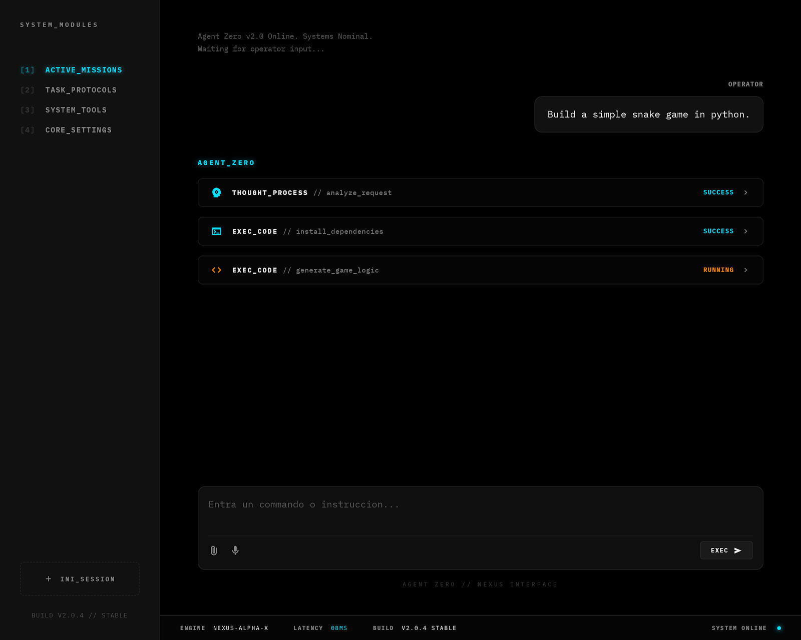
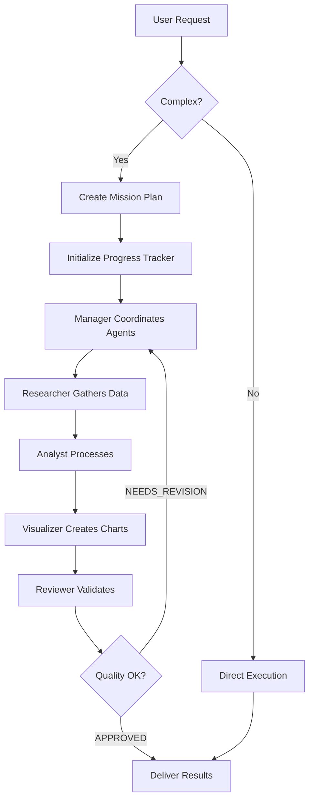

# ⚡ Nexus Agent 2.0 - Advanced AI Multi-Agent System



**Nexus Agent** is an advanced multi-agent AI framework that goes beyond simple chatbots. It orchestrates a team of specialized AI agents with intelligent workflow planning, quality review, and stunning real-time visualization.

## 🌟 What's New in Nexus 2.0

### 🎯 **Intelligent Mission Planning**
Nexus now automatically detects complex requests and creates structured mission plans:
- **Automatic Complexity Detection**: Analyzes requests to determine if mission planning is needed
- **Task Breakdown**: Splits complex objectives into actionable sub-tasks
- **Persistent Plan Files**: Saves mission plans as `plan_{session_id}.md` in `workspace/mission_plans/`
- **Real-time Progress Tracking**: Visual progress indicator showing task completion

### 🔍 **Quality Review System**
New **Reviewer Agent** validates all outputs before delivery:
- **Automated Quality Control**: Reviews completeness, accuracy, and coherence
- **Quality Scoring**: Provides 0-100 quality scores with detailed feedback
- **Status Tracking**: APPROVED vs NEEDS_REVISION with actionable recommendations
- **Re-execution Ready**: Framework supports iterative refinement (future)

### 📊 **Enhanced UI Experience**
- **🎨 Progress Tracker**: Floating real-time indicator showing task execution progress
- **📦 Tool Grouping**: All tool calls from same agent grouped in single collapsible card
- **💬 Multi-Session Chat**: Persistent chat sessions with SQLite storage
- **🎭 Agent Icons**: Distinct visual identity for each specialist (Researcher, Analyst, Visualizer, etc.)
- **🌈 Improved Readability**: Lighter reasoning text, purple sub-agent bubbles

### 🤖 **Expanded Agent Prompts**
All agents now have comprehensive 100-250+ line prompts defining:
- **Detailed Methodologies**: Step-by-step workflows for each agent type
- **Quality Standards**: Explicit requirements for outputs
- **Tool Usage Guidelines**: Best practices for each tool
- **Error Handling**: Fallback strategies and recovery procedures

### 🎭 **Dynamic Agent Creation** ⭐ **NEW**
Nexus can now create specialized agents on-demand:
- **Automatic Evaluation**: Analyzes task requirements and identifies missing specializations
- **Dynamic Instantiation**: Creates agents with custom roles, instructions, and tools
- **Session-Based**: New agents exist for the current session and task
- **LLM-Powered**: Uses AI to determine optimal agent configurations

---

## 🚀 Core Features

### 🤖 Multi-Agent Orchestration

Nexus uses a **Manager-Specialist** architecture powered by `agno`:

| Agent | Role | Tools |
|-------|------|-------|
| **👔 Nexus Manager** | Team leader, orchestrates workflow, delegates tasks | All agents |
| **🕵️ Researcher** | Web research specialist | DuckDuckGo, SerpApi, Exa, Arxiv, Newspaper |
| **📊 Analyst** | Financial data & market analysis | YFinance, commodity tracking |
| **📚 Librarian** | Local knowledge management (RAG) | LanceDB vector search |
| **📈 Visualizer** | Data visualization expert | ChartTools (7 chart types) |
| **✅ Reviewer** | Quality assurance & validation | Analysis framework |

### 🧠 Local RAG (Retrieval-Augmented Generation)

- **Vector Database**: Uses `LanceDB` for high-performance local vector storage
- **Knowledge Base**: Drop PDFs into `workspace/knowledge` or upload via UI
- **Automatic Indexing**: Documents are embedded and made searchable
- **Source Citations**: Nexus cites sources in responses

### 💻 Cyberpunk-Inspired UI

- **Tech Stack**: FastAPI (Backend) + Vanilla JS/Tailwind (Frontend)
- **Real-time Streaming**: Server-Sent Events (SSE) for fluid responses
- **Interactive Cards**: Collapsible tool execution cards showing thinking process
- **Agent Visualization**: Distinctive visual cues (Purple Bubbles) for sub-agents
- **Dark Theme**: Sleek cyberpunk aesthetic with accent colors

---

## 🛠️ Installation & Setup

### Prerequisites

- Python 3.10+ (3.11+ recommended)
- pip & venv
- Git (for version control)

### 1. Clone Repository

```bash
git clone https://github.com/nibaldox/nexus-agent.git
cd nexus-agent
```

### 2. Create Virtual Environment

**Windows:**
```powershell
python -m venv .venv
.venv\Scripts\Activate.ps1
```

**Linux/macOS:**
```bash
python -m venv .venv
source .venv/bin/activate
```

### 3. Install Dependencies

```bash
pip install -r requirements.txt
```

### 4. Configure Environment

Create `.env` file with your API keys:

```env
# OpenRouter API Key (required for all LLM calls)
OPENAI_API_KEY=sk-or-v1-...

# Search Tools (optional but recommended)
SERPER_API_KEY=...   # For SerpApi web search
EXA_API_KEY=...      # For Exa semantic search

# Other optional keys
# OPENAI_API_KEY_DIRECT=sk-...  # Direct OpenAI fallback
```

> **Note**: Nexus uses OpenRouter by default, which provides access to 100+ models including GLM-4.7 and MiniMax.

### 5. Run Server

**Option A - Quick Start (Windows):**
```bash
run.bat
```

**Option B - Manual:**
```bash
uvicorn api:app --host 127.0.0.1 --port 8000 --reload
```

**Option C - Production:**
```bash
uvicorn api:app --host 0.0.0.0 --port 8000
```

Open **http://127.0.0.1:8000** in your browser.

---

## 📖 Usage Guide

### Basic Chat

Simply type questions or commands:
```
"What's the latest news on AI?"
"Analyze Apple stock performance"
```

### Complex Missions (Auto-Planning)

For complex requests, Nexus automatically creates a mission plan:

```
"Analyze the top 5 tech companies, their growth trends in the last year, 
and create a comparative chart of their market caps"
```

**What happens:**
1. 🎯 **Planning Phase**: Nexus detects complexity and creates plan.md
2. ⚙️ **Execution Phase**: Agents execute tasks sequentially
3. ✅ **Review Phase**: Reviewer validates outputs
4. 📊 **Progress Tracker**: Shows real-time progress in top-right corner

### Upload Documents (RAG)

1. Click the 📎 attachment icon in chat input
2. Select PDF files
3. Wait for indexing confirmation
4. Ask questions: *"What does the uploaded report say about Q4 earnings?"*

### View Visualizations

Cuando el Visualizer crea gráficos, se guardan en `workspace/` con orden por sesión:
- **Por sesión**: `workspace/conversations/{session_id}/assets/charts/`
- **Publicación UI**: `workspace/assets/charts/` (para servir `/assets/charts/...`)
- Se muestran automáticamente en el chat

### Multi-Session Management

- **Sidebar**: View all "Active Missions" (chat sessions)
- **Switch Sessions**: Click on any session to resume
- **New Session**: Click "+ New Mission" button
- **Persistence**: All sessions saved to `agent.db` SQLite database

---

## 📁 Project Structure

```
nexus-agent/
├── agents/                  # Agent definitions
│   ├── manager.py          # Nexus Manager (coordinator)
│   ├── researcher.py       # Web research specialist
│   ├── analyst.py          # Financial analysis
│   ├── librarian.py        # RAG specialist
│   ├── visualizer.py       # Chart generation
│   └── reviewer.py         # Quality assurance (NEW)
├── frontend/               # Web UI
│   ├── index.html         # Main page
│   ├── js/
│   │   ├── main.js        # Event handling & SSE
│   │   ├── ui.js          # UI components
│   │   └── progress.js    # Progress tracker (NEW)
│   ├── css/
│   │   ├── index.css      # Main styles
│   │   └── responsive.css # Mobile/sidebar
├── workspace/
│   ├── assets/            # Public assets for UI (charts)
│   ├── conversations/     # Session-scoped files and artifacts
│   │   └── <session_id>/assets/charts/
│   ├── knowledge/         # RAG documents (PDFs)
│   └── mission_plans/     # Generated plans (NEW)
├── nexus_workflow.py      # Workflow orchestration (NEW)
├── api.py                 # FastAPI backend
├── agent.db               # SQLite sessions
└── requirements.txt       # Python dependencies
```

---

## 🎨 Workflow Architecture

### Nexus 2.0 Execution Flow



### Agent Communication

```
User Request
    ↓
Nexus Manager (Coordinator)
    ↓
    ├─→ Researcher (Web Search + Data)
    ├─→ Analyst (Financial Analysis)
    ├─→ Visualizer (Charts)
    └─→ Librarian (RAG Search)
    ↓
Reviewer (Quality Check)
    ↓
Final Response to User
```

---

## 🔧 Configuration

### Model Selection

Edit agent files to change models (via OpenRouter):

```python
# agents/manager.py
model = "z-ai/glm-4.7"  # Manager uses GLM-4.7 (120k tokens)

# agents/researcher.py  
model = "minimax/minimax-m2.1"  # Specialists use MiniMax
```

### Tool Configuration

**Researcher Tools** (`agents/squads/data_intelligence/researcher.py`):
```python
tools = [
    SerperTools(),         # Primary (requires API key)
    DuckDuckGoTools(),     # Fallback
]
```

**Visualizer Charts** (`agents/squads/data_intelligence/visualizer.py`):
- Line, Bar, Pie, Scatter, Area, Histogram, Box Plot
- Saved to `workspace/conversations/{session_id}/assets/charts/` and published in `workspace/assets/charts/`
- Modern color palettes with gradients

---

## 🚀 Advanced Features

### 1. Progress Tracking

The floating progress indicator shows:
- **Task List**: Current tasks being executed
- **Agent Assignment**: Which agent is handling each task
- **Progress Bar**: Visual 0-100% completion
- **Timer**: Elapsed time since mission start
- **Status Icons**: Pending → Running → Done

### 2. Tool Execution Grouping

All tool calls from the same agent are now grouped:
```
Tools_Execution [Researcher]
  ├─ web_search → Done (0.8s)
  ├─ web_search → Done (1.2s)
  └─ extract_content → Done (0.5s)
```

### 4. Dynamic Agent Creation

The Nexus Manager can evaluate task complexity and create specialized agents automatically:

**Example**: For "Analyze cryptocurrency market trends and create investment recommendations"

**What happens**:
1. 🎯 **Evaluation**: Manager analyzes task requirements
2. 🧠 **AI Assessment**: Determines if specialized crypto knowledge is needed  
3. ⚙️ **Dynamic Creation**: Creates "CryptoAnalyst" agent with relevant tools
4. 🤝 **Integration**: Adds new agent to the team for this session
5. 📊 **Execution**: Delegates crypto-specific tasks to the new agent

**Benefits**:
- Adapts to any domain without manual agent creation
- Maintains specialization for complex tasks
- Reduces need for predefined agent libraries

### 4. Session Persistence

All chat history is stored in SQLite (`agent.db`):
```sql
CREATE TABLE nexus_team_sessions (
    id TEXT PRIMARY KEY,
    created_at TIMESTAMP,
    last_updated TIMESTAMP,
    history TEXT  -- JSON array of messages
);
```

---

## 🧪 Testing

### Quick Test - Simple Query
```
"What's the weather in Paris?"
```
Expected: Direct response (no planning)

### Complex Test - Full Workflow
```
"Research the top 3 renewable energy companies, analyze their stock 
performance over the past year, and create a comparative visualization"
```

Expected:
1. 🎯 Mission Planning event
2. 📊 Progress Tracker appears
3. 🕵️ Researcher activates → searches web
4. 📊 Analyst activates → fetches stock data
5. 📈 Visualizer activates → creates chart
6. ✅ Reviewer activates → validates quality
7. ✨ Final response with chart + data

---

## 🐛 Troubleshooting

### "ModuleNotFoundError: agno"
```bash
pip install agno
```

### "max_tokens" Error
- **Solution**: Reduce context or use model with higher token limit
- **Note**: GLM-4.7 supports 120k tokens (reduced from 200k to leave room for context)

### Charts Not Saving
- Check `workspace/assets/charts/` directory exists
- Check session folder `workspace/conversations/{session_id}/assets/charts/`
- Verify write permissions
- Review ChartTools configuration

### Progress Tracker Not Appearing
- Clear browser cache
- Verify `progress.js` is loaded in DevTools Console
- Check for "PlanCreated" event in Network tab (SSE)

---

## 🤝 Contributing

Contributions welcome! Please:

1. Fork the repository
2. Create a feature branch (`git checkout -b feature/amazing-feature`)
3. Commit changes (`git commit -m 'Add amazing feature'`)
4. Push to branch (`git push origin feature/amazing-feature`)
5. Open a Pull Request

### Development Guidelines

- Follow existing code style
- Add comments for complex logic
- Test with both simple and complex queries
- Update README if adding features

---

## 📜 License

MIT License - see LICENSE file for details

---

## 🙏 Acknowledgments

- **agno**: Multi-agent orchestration framework
- **LanceDB**: High-performance vector database
- **OpenRouter**: Multi-model LLM API gateway
- **FastAPI**: Modern Python web framework
- **Tailwind CSS**: Utility-first CSS framework

---

## 📞 Support

- **Issues**: [GitHub Issues](https://github.com/nibaldox/nexus-agent/issues)
- **Discussions**: [GitHub Discussions](https://github.com/nibaldox/nexus-agent/discussions)
- **Email**: nibaldox@example.com

---

**Version**: 2.0.1  
**Last Updated**: 2026-01-20  
**Status**: ✅ Production Ready

*Built with ❤️ by the Nexus Team*
