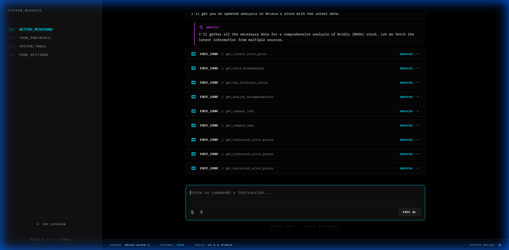
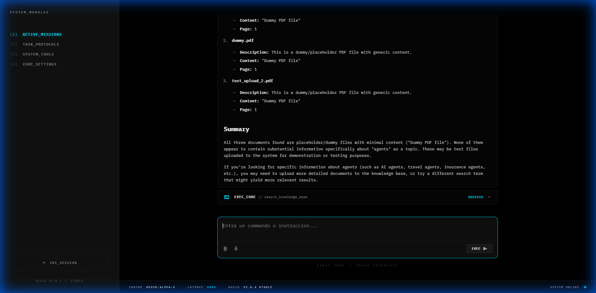
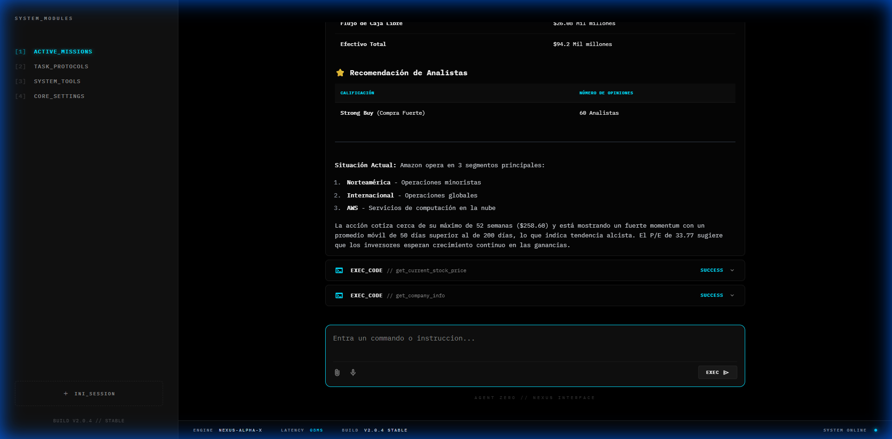

# 🚀 Recorrido de Nexus AI

## 🌟 Visión General
Este proyecto transforma un script de Agente simple en un **Asistente de IA interactivo completo ("Nexus")**.
Las características clave incluyen una **Interfaz Web**, **Orquestación Multi-Agente**, **RAG Local (Base de Conocimiento)**, y **Tarjetas de Herramientas Ricas**.

## ✨ Características Implementadas

### 1. **Interfaz Web Interactiva**
- **Stack Tecnológico**: FastAPI (Backend) + Vanilla JS/HTML/CSS (Frontend).
- **Características**: 
  - Respuestas en streaming (SSE).
  - Renderizado rico de Markdown (Tablas, Bloques de código).
  - **Tarjetas de Herramientas**: Tarjetas expandibles que muestran entradas/salidas de herramientas (ej. Resultados de Búsqueda).
  - **Identidad del Agente**: Branding "Nexus Interface" con estética Cyberpunk.

### 2. **Arquitectura Multi-Agente** 🤖 [NUEVO]
- **Estructura**: Un agente "Manager" orquesta un equipo de especialistas.
- **Agentes**:
  - **Manager (Nexus Lead)**: Interactúa con el usuario y delega tareas.
  - **Researcher**: Usa DuckDuckGo para búsquedas web.
  - **Analyst**: Usa YFinance para datos bursátiles.
  - **Librarian**: Gestiona la base de conocimiento local de PDFs (RAG).
- **Delegación Visual**:
  - Burbujas moradas distintivas para respuestas de sub-agentes (ej. "ANALYST" hablando con el Manager).
  - Separación clara de herramientas y flujo de conversación.

### 3. **RAG Local (Base de Conocimiento)** 🧠
- **Tecnología**: `LanceDb` (Almacén Vectorial) + `OpenAIEmbeddings`.
- **Funcionalidad**:
  - **Ingestión**: Arrastra archivos PDF a `workspace/knowledge` (o usa la subida en UI).
  - **Recuperación**: El agente busca inteligentemente en documentos para responder consultas.
  - **Subida de Archivos**: La UI soporta subida directa de PDFs a la base de conocimiento.

### 4. **Autoscroll Inteligente**
- **Mejora de UX**: El chat solo hace autoscroll si el usuario ya está al final. Permite leer el historial durante la generación.

## 📸 Verificación

### Visualización de Sub-Agentes (Delegación)

*Nexus Manager delegando al Analista. Nota la burbuja distintiva "ANALYST" mostrando la comunicación interna del equipo.*

### Interacción Multi-Agente

*Nexus Manager delegando al Bibliotecario (Librarian) para encontrar documentos PDF.*

### Restauración del Chat (Corrección de Eventos Team)

*Verificando comunicación y delegación exitosa tras arreglar el problema de streaming de Eventos de Team.*

### Tarjetas de Búsqueda Ricas
 *(Placeholder si está presente)*

## 🛠️ Próximos Pasos
- [ ] **Interacción por Voz**: Añadir capacidades TTS/STT.
- [ ] **Persistencia de Memoria**: Asegurar que el historial de sesión persista entre recargas (parcialmente implementado vía SqliteDb).
