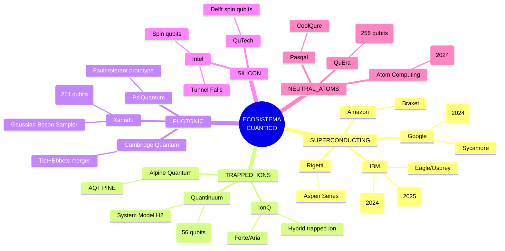

# Visualización 1: Mapa del Ecosistema de Computación Cuántica

## Posicionamiento por Tipo de Qubit (2024-2025)



## Matriz de Posicionamiento Competitivo

```mermaid
quadrantChart
    title "Posicionamiento de Plataformas Cuánticas"
    x-axis "Aplicación Comercial -->" to "Investigación Fundamental"
    y-axis "Madura (2024) -->" to "Emerging (2025+)"
    quadrant-1 "Líderes de Mercado"
    quadrant-2 "Especialistas"
    quadrant-3 "New Entrants"
    quadrant-4 "Visionarios"
    "Google Willow": [0.85, 0.75]
    "IBM Heron": [0.80, 0.70]
    "IonQ Aria": [0.70, 0.85]
    "Quantinuum H2": [0.65, 0.80]
    "Xanadu Borealis": [0.55, 0.90]
    "Pasqal CoolQure": [0.45, 0.75]
    "Atom Comp 1225": [0.40, 0.95]
    "PsiQuantum": [0.35, 0.88]
    "Microsoft Majorana": [0.30, 0.95]
    "Rigetti": [0.60, 0.55]
```

---

*Nota: El eje X representa el madurez hacia aplicaciones comerciales vs investigación. El eje Y indica la madurez tecnológica actual vs potencial emergente.*