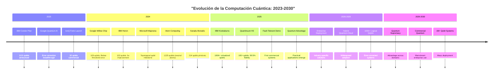
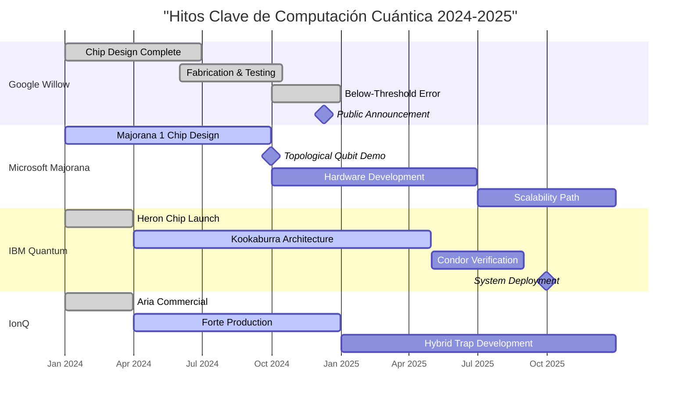

# Visualización 2: Timeline de Hitos Cuánticos 2023-2030

## Roadmap Histórico y Proyectado

## Detalle de Hitos Clave 2024-2025

---

## Logros Destacados 2024

| Empresa | Logro Principal | Impacto |
|---------|-----------------|---------|
| **Google** | Willow Chip (105 qubits, error ↓ umbral) | Primer sistema bajo umbral de error |
| **Microsoft** | Majorana 1 (topological qubit) | Nueva era de estabilidad |
| **IBM** | Heron (133 qubits, 5x mejora) | Camino claro hacia utilidad |
| **Atom Computing** | 1225 qubits (neutral atoms) | Mayor número de qubits físicos |
| **Xanadu** | Borealis (214 qubits photonic) | Liderazgo en fotónica |