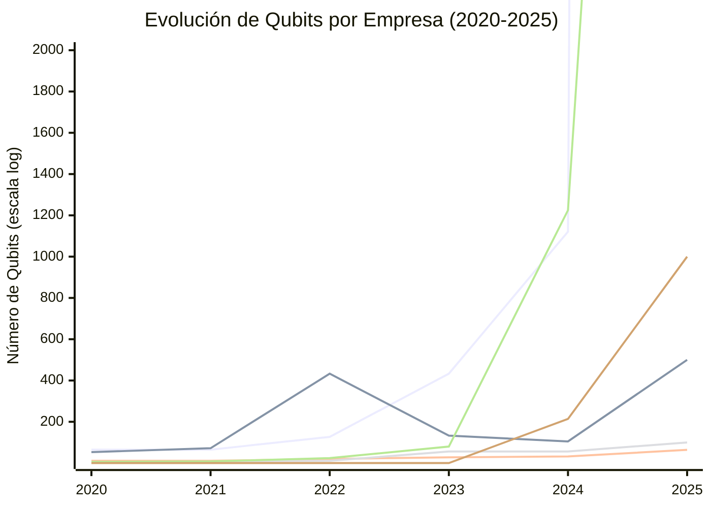
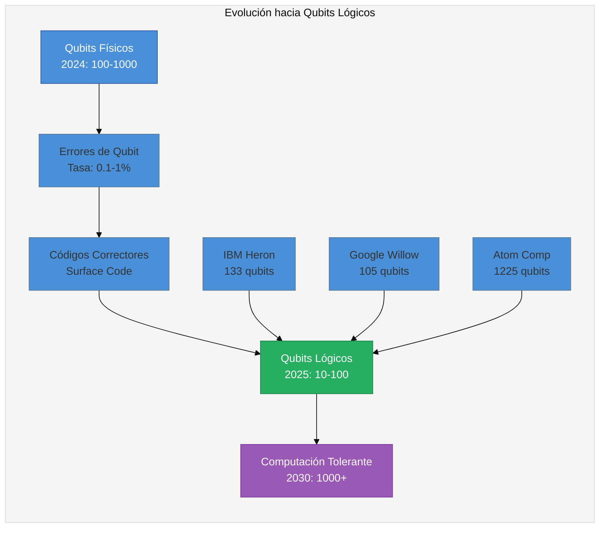
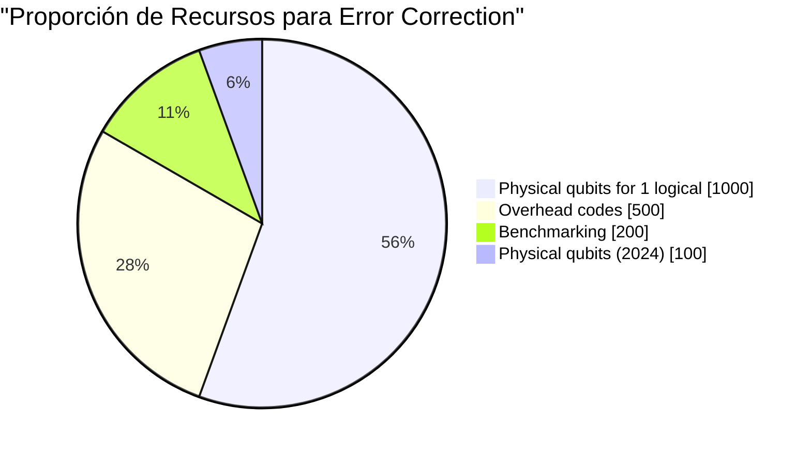

# Visualización 3: Evolución de Qubits por Empresa (2020-2025)

## Comparación del Número de Qubits (2020-2025)

*Nota: IBM=azul, Google=naranja, IonQ=verde, Quantinuum=rojo, Atom Computing=morado, Xanadu=cyan*

---

## Datos de Evolución (Tabla)

| Empresa | 2020 | 2021 | 2022 | 2023 | 2024 | 2025 Proy |
|---------|------|------|------|------|------|-----------|
| **IBM** | 65 | 65 | 127 | 433 | 1121 | 100K+ (virtual) |
| **Google** | 53 | 72 | 433 | 133 | 105 | 500+ |
| **IonQ** | 11 | 11 | 20 | 28 | 32 | 64 |
| **Quantinuum** | 5 | 7 | 11 | 56 | 56 | 100 |
| **Atom Computing** | 6 | 8 | 24 | 80 | 1225 | 10K+ |
| **Xanadu** | 0 | 0 | 0 | 0 | 214 | 1000+ |

---

## Proyección de Qubits Lógicos vs Físicos

---

## Roadmap de Error Correction (2024-2030)

*El objetivo 2030: 1000+ qubits lógicos con error rate < 10⁻¹²*