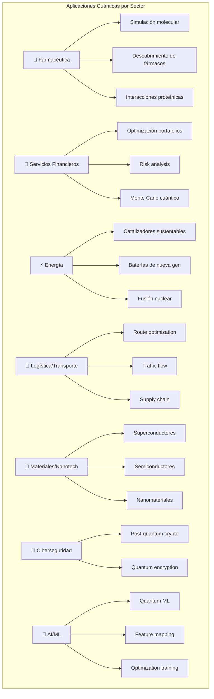
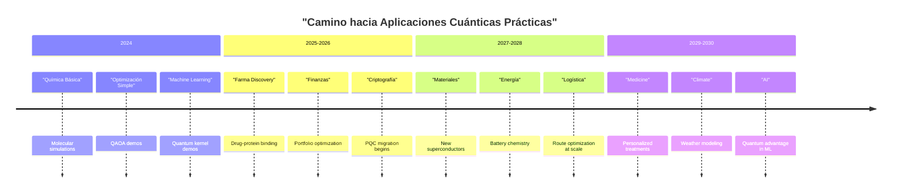
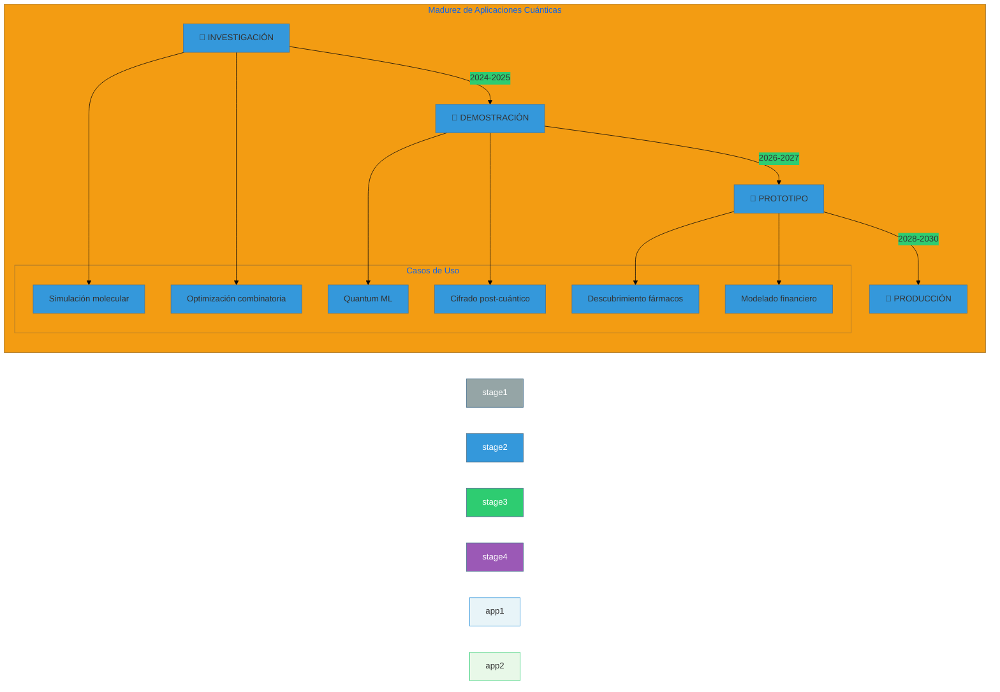

# Visualización 4: Infografía de Aplicaciones Cuánticas

## Casos de Uso por Industria

## Timeline hacia Utilidad Práctica

## Matriz de Madurez de Aplicaciones

---

## Impacto Económico Proyectado

| Industria | Impacto 2030 | Caso de Uso Principal |
|-----------|--------------|----------------------|
| **Farmaceutical** | $200B+ | Descubrimiento de fármacos |
| **Finanzas** | $100B+ | Optimización de riesgo |
| **Energía** | $50B+ | Baterías/catalizadores |
| **Logística** | $80B+ | Route optimization |
| **Materiales** | $150B+ | Nuevos materiales |
| **Ciberseguridad** | $30B+ | Transición PQC |