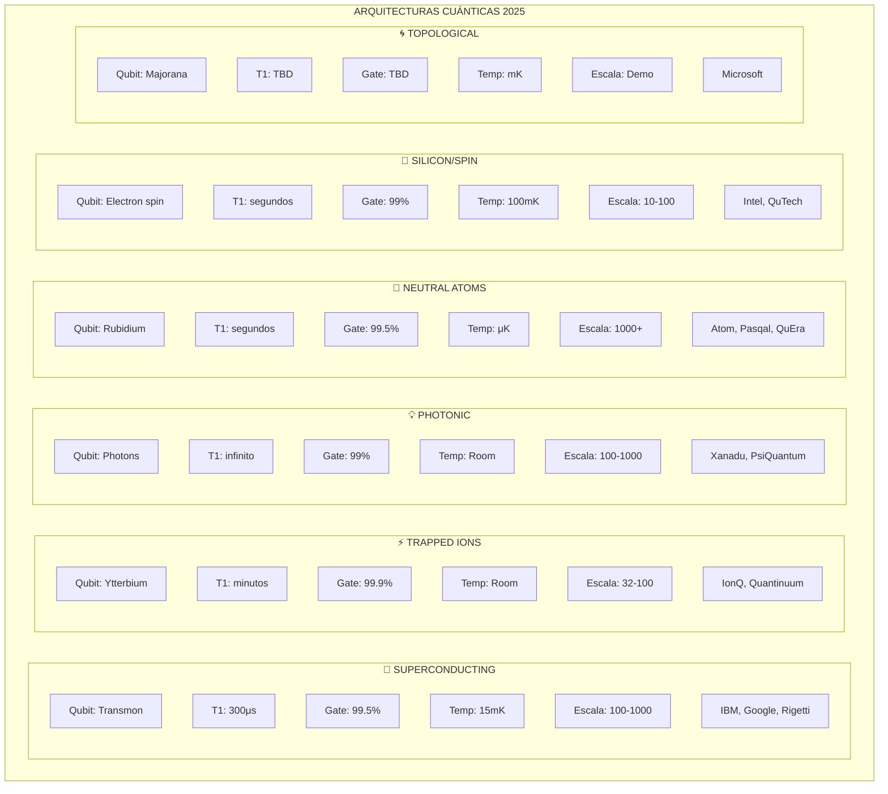
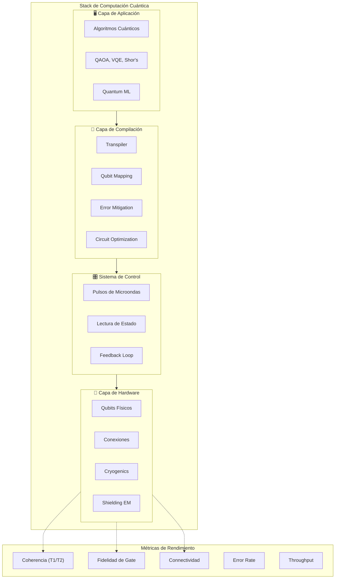

# Visualización 5: Arquitectura de Plataformas Cuánticas

## Comparación Técnica de Plataformas



## Diagrama Detallado de Arquitectura



## Matriz Comparativa de Plataformas

```mermaid
table
    title "Comparación Técnica de Plataformas Cuánticas"
    "Plataforma" | "Qubits (2024)" | "Fidelidad Gate" | "T1 Coherence" | "Escalabilidad" | "Maturidad"
    "IBM Supercond." | 1121 | 99.5% | 300μs | ★★★★☆ | ★★★★★ |
    "Google Willow" | 105 | 99.7% | 500μs | ★★★★☆ | ★★★★☆ |
    "IonQ Trap" | 32 | 99.9% | 10+ min | ★★★☆☆ | ★★★★☆ |
    "Quantinuum H2" | 56 | 99.8% | 30+ min | ★★★☆☆ | ★★★★☆ |
    "Atom Comp" | 1225 | 99.5% | 3 seg | ★★★★★ | ★★★☆☆ |
    "Xanadu Borealis" | 214 | 99% | ∞ | ★★★★☆ | ★★★☆☆ |
    "Microsoft Majorana" | 1 | TBD | TBD | ★★★★★ | ★★☆☆☆ |
    "Intel Spin" | 12 | 99% | 1 seg | ★★★☆☆ | ★★☆☆☆ |
```

---

## Ventajas y Desafíos por Plataforma

| Plataforma | ✅ Ventajas | ❌ Desafíos |
|------------|-------------|-------------|
| **Superconducting** | Maduras, alta fidelidad, gran escala | Criogenía extrema, interferencia |
| **Trapped Ions** | Fidelidad máxima, coherencia larga | Escalabilidad limitada, lento |
| **Photonic** | Room temp, coherencia perfecta | Gates difíciles, detección |
| **Neutral Atoms** | Mayor escala potencial | Nuevo, fidelidad variable |
| **Silicon/Spin** | Compatibilidad CMOS, escala | T1 corto, fidelididad media |
| **Topological** | Error natural, estable | No demostrado aún |